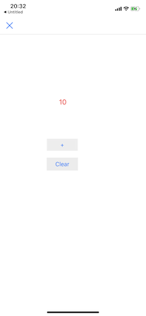
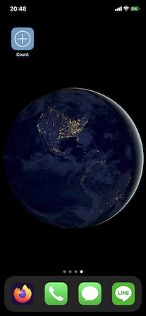
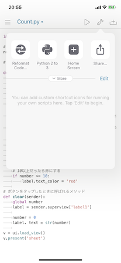
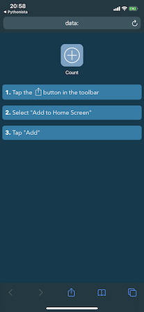

- In this repo, there are python apps below:  	
  
-   Count 	
- 	Progate/Python3 	(Cafe Ordering App)
- 	TimerWithPython

# COUNT

## Description
- an app program to count up numbers

- you can also add the app to homescreen.

## Author
- sunsetpeak1861

## Installation
- import the folder to pythonista and run count.py
- to add the app to homescreen, 
- 1. go to Count.py
- 2. push the wrench icon on top right
- 3. tap "Home Screen"
- 4. change the preferences

- 5. tap Continue, and follow the instruction on your display.

## Reference
- https://qiita.com/taznica/items/34fb3395f085e5e11f6e
